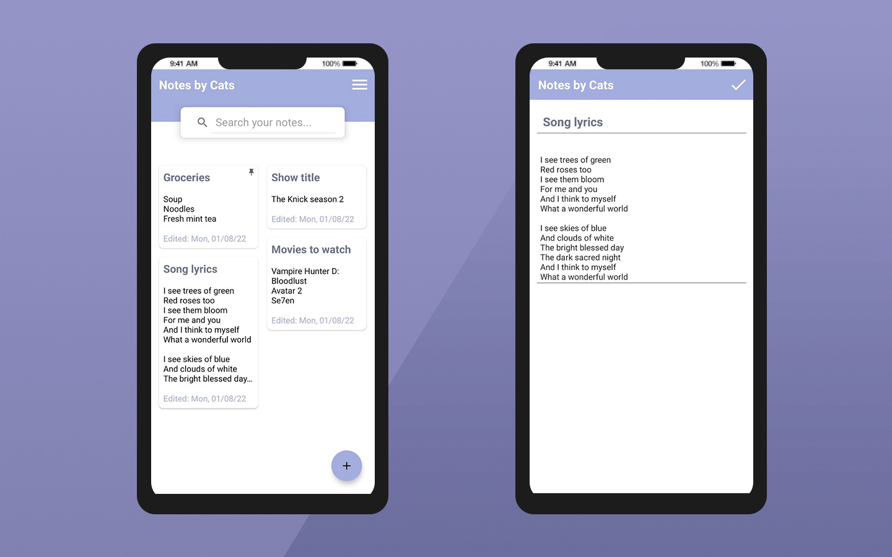
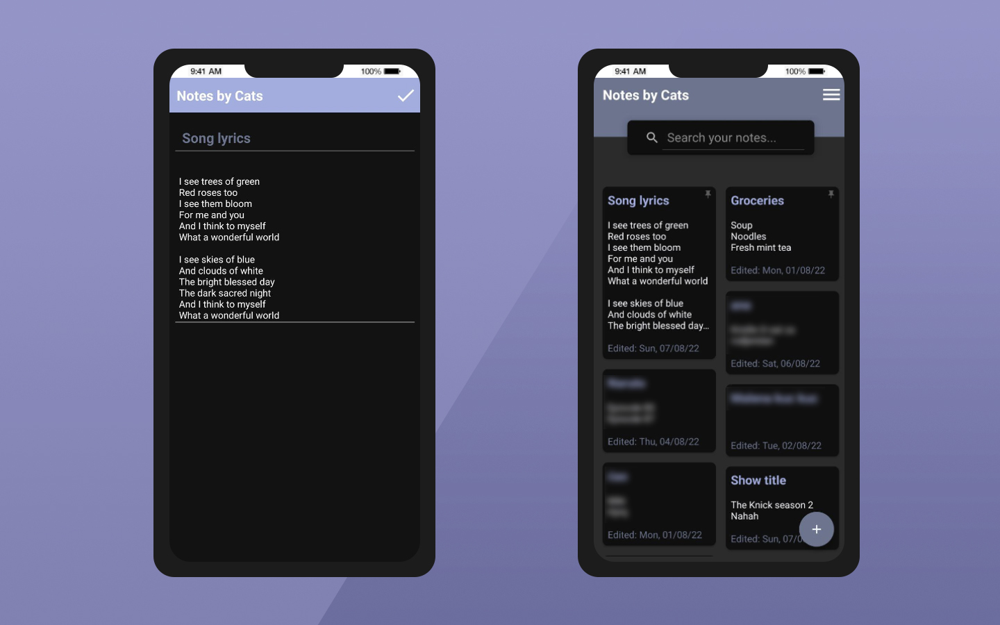

# Notes by Cats - Android Note Application
## Android CRUD application for taking notes  

This simple mobile application allows it's users to keep track of their notes. It was made in **Android Studio** using **Kotlin** programming language.

Other than the main notes panel, it includes two bonus simple activities, which are Dev About Me page, and some very basic settings regarding the look of the app. **Dark theme** can be enabled in the settings section.

## Screenshots

